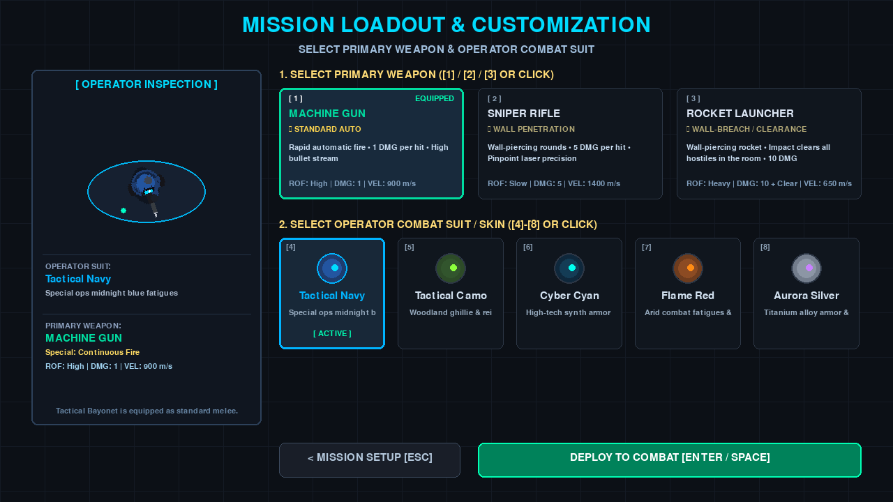

# 2D Top-Down Shooting Game

## English

A 2D top-down shooting game prototype built with Python and Pygame.
The player must eliminate all enemies across different maps and earn a final grade based on kills, remaining health, completion time, shooting accuracy, and melee kills.

## Latest Update — Consolidated Requirements v3

### Gameplay and Difficulty

- Added three configurable difficulty modes:
  - **Easy:** 20 player HP / Lives, 3 HP per enemy, score multiplier `1.0x`.
  - **Medium:** 15 player HP / Lives, 5 HP per enemy, score multiplier `1.5x`.
  - **Hard:** 10 player HP / Lives, 10 HP per enemy, score multiplier `2.2x`.
- In Hard mode, every defeated enemy drops a Medkit at its death location.
- Medkits at map supply points and Hard-mode enemy drops are picked up immediately on contact, even when the player's HP is full.
- Enemies actively patrol through waypoints, investigate gunfire, detect the player through line of sight, and hunt instead of remaining at their spawn points.

### Maps and Mission Flow

- Added five selectable tactical maps with the required enemy distribution:

  | Map | Size | Enemies | Supply Medkits |
  |---|---|---:|---:|
  | Map 1: CQB Bunker | Small | 3 | 0 |
  | Map 2: Industrial Compound | Medium A | 5 | 2 |
  | Map 3: Urban Ruins | Medium B | 5 | 2 |
  | Map 4: Military Airbase | Large A | 7 | 3 |
  | Map 5: Research Labs | Large B | 7 | 4 |

- Changed the mission flow to **Start Menu → Loadout Selection → Gameplay**.
- The Loadout screen provides a live operator preview, primary weapon selection, and character skin selection.

### Weapons and Combat Fixes

- **Machine Gun:** Automatic fire with unlimited standard ammunition.
- **Sniper Rifle:** 5 damage per hit, wall penetration, and a maximum of 10 rounds per mission.
- **Rocket Launcher:** Maximum of 3 rockets per mission; wall-piercing impact clears all enemies in the room or space reached by the rocket.
- Interior walls hit by a player-fired rocket are removed from collision and minimap rendering, allowing the player to walk through the new opening.
- The outer map boundary remains indestructible.
- Standard bullets still stop at walls. Melee attacks now require line of sight, fixing the previous ability to kill through walls.
- The weapon information cards now wrap long descriptions within their card boundaries.

### HUD, Pause, Help, and Scoring

- Added a real-time top-right minimap showing walls, live player and enemy positions, and active Medkits.
- Added bottom-right gameplay metrics for elapsed time (`MM:SS`), current score, and limited-weapon ammo (`k/n`) for the Sniper Rifle and Rocket Launcher.
- Pressing `Esc` during gameplay opens a Pause Menu with Resume, Restart, and Return to Main Menu options.
- Added a bottom-right `?` button on the Start Menu.
- The Help modal now uses separate Easy, Medium, and Hard tabs for difficulty settings, scoring formulas, and Grade A–E thresholds.
- Help content stays inside the fixed blue modal frame and supports mouse-wheel scrolling.
- Easy Mode Grade A was rebalanced to 750 points. Medium and Hard retain the competitive thresholds:
  - **Easy:** A 750, B 550, C 400, D 250, E 0.
  - **Medium / Hard:** A 1200, B 900, C 650, D 400, E 0.
- Final score combines elimination ratio, remaining HP, completion time, shooting accuracy, melee-kill bonuses, and the selected difficulty multiplier.

### Features

- Five tactical maps with different sizes and layouts
- Three difficulty levels: Easy, Medium, and Hard
- Loadout screen with Machine Gun, Sniper Rifle, Rocket Launcher, and selectable operator skins
- Machine gun, wall-piercing sniper rifle, room-clearing rocket launcher, and bayonet melee combat
- Enemy AI, line-of-sight detection, cover, and obstacle collisions
- Medical supply stations and medkits
- HUD with minimap, health, enemy count, timer, score, ammo, and combat information
- Mission scoring system with Grades A-E

### Requirements

- Python 3
- Pygame 2.6.1

### Installation and Usage

Clone the repository and enter the project directory:

```bash
git clone https://github.com/sunweishan/2d-top-down-shooting-game.git
cd 2d-top-down-shooting-game
```

Create and activate a virtual environment:

```bash
python3 -m venv .venv
source .venv/bin/activate
```

Install the dependencies:

```bash
pip install -r requirements.txt
```

Start the game:

```bash
python main.py
```

### Controls

#### During Gameplay

| Action | Key |
|---|---|
| Move | `WASD` or Arrow Keys |
| Aim | Move the Mouse |
| Fire Equipped Primary Weapon | Left Mouse Button |
| Bayonet Attack | `Space` or `F` |
| Pause / Resume | `Esc` |

#### Loadout Selection

| Action | Key |
|---|---|
| Select Machine Gun | `1` |
| Select Sniper Rifle | `2` |
| Select Rocket Launcher | `3` |
| Select Navy skin | `4` |
| Select Tactical Camo skin | `5` |
| Select Cyber Cyan skin | `6` |
| Select Flame Red skin | `7` |
| Select Aurora Silver skin | `8` |
| Deploy to Gameplay | `Enter` or `Space` |
| Return to Mission Setup | `Esc` |

#### Start Menu

| Action | Key |
|---|---|
| Select Map 1-5 | Number Keys `1` to `5` |
| Select Difficulty | `E` = Easy, `M` = Medium, `H` = Hard |
| Cycle Difficulty | Left / Right Arrow Keys |
| Start Mission | `Enter` or `Space` |

#### Pause and Result Screens

- Press `R` during pause to restart the mission.
- Press `M` during pause to return to the main menu.
- Press `R` after victory or defeat to play again.
- Press `Esc` after victory or defeat to return to mission setup.

### Testing

Run the game logic tests:

```bash
python -m unittest -q
```

### Project Structure

```text
main.py             # Main game loop and state management
player.py           # Player control, movement, and attacks
enemy.py            # Enemy AI and behavior
weapon.py           # Machine gun and bayonet systems
bullet.py           # Bullets, collision, and damage detection
map.py              # Maps, obstacles, and cover
supply.py           # Medical supply system
sprites.py          # Character and object rendering
effects.py          # Visual effects
audio.py            # Audio management
ui.py               # Menus, HUD, pause, and result screens
test_game_logic.py  # Game logic tests
requirements.txt    # Python dependencies
```

### Screenshots

#### Start Menu


#### Loadout Selection / Customization



#### Gameplay


#### Victory Screen


---

## 中文

這是一款使用 Python 與 Pygame 製作的 2D 俯視角射擊遊戲原型。
玩家需要在不同地圖中消滅所有敵人，並根據擊殺數、剩餘生命值、完成時間、射擊準確率與近戰擊殺數取得最終評等。

## 最新更新 — Consolidated Requirements v3

### 遊戲玩法與難度

- 新增三種可設定的難度：
  - **Easy：** 玩家 20 HP／生命值、每名敵人 3 HP、分數倍率 `1.0x`。
  - **Medium：** 玩家 15 HP／生命值、每名敵人 5 HP、分數倍率 `1.5x`。
  - **Hard：** 玩家 10 HP／生命值、每名敵人 10 HP、分數倍率 `2.2x`。
- Hard 模式中，每名被擊敗的敵人會在死亡位置掉落醫療包。
- 地圖補給點與 Hard 模式敵人掉落的醫療包，玩家接觸後會立即拾取，即使目前 HP 已滿也可以拾取。
- 敵人現在會沿著路徑巡邏、調查槍聲，並透過視線偵測與追獵玩家，不會固定停留在出生點。

### 地圖與任務流程

- 新增 5 張可選擇的戰術地圖，敵人配置如下：

  | 地圖 | 規模 | 敵人數 | 固定補給醫療包 |
  |---|---|---:|---:|
  | Map 1：CQB Bunker | Small | 3 | 0 |
  | Map 2：Industrial Compound | Medium A | 5 | 2 |
  | Map 3：Urban Ruins | Medium B | 5 | 2 |
  | Map 4：Military Airbase | Large A | 7 | 3 |
  | Map 5：Research Labs | Large B | 7 | 4 |

- 任務流程改為 **主選單 → 配裝選擇 → 遊戲進行**。
- 配裝畫面提供玩家角色即時預覽、主武器選擇與角色外觀選擇。

### 武器與戰鬥修正

- **機槍：** 自動射擊，使用無限標準彈藥。
- **狙擊槍：** 每次命中造成 5 點傷害，可穿透牆壁，每場任務最多 10 發。
- **火箭筒：** 每場任務最多 3 發；具備穿牆效果，火箭進入目標房間或空間後爆炸，會消滅該空間內的所有敵人。
- 玩家火箭擊中的室內牆壁會從碰撞與小地圖中移除，形成玩家可以通過的開口。
- 地圖最外圍邊界牆不可破壞。
- 一般子彈仍會被牆壁阻擋；近戰攻擊現在必須符合視線判定，修正隔牆殺敵問題。
- 武器介紹卡片的長文字會自動換行，不會超出卡片範圍。

### HUD、暫停、說明與評分

- 右上角新增即時小地圖，顯示牆壁、玩家、存活敵人與尚未拾取的醫療包位置。
- 右下角新增遊戲時間（`MM:SS`）、即時分數，以及狙擊槍／火箭筒的剩餘彈藥（`k/n`）。
- 遊戲中按下 `Esc` 會立即開啟暫停選單，提供繼續、重新開始與返回主選單。
- 主選單右下角新增 `?` 說明按鈕。
- 說明視窗改為 Easy、Medium、Hard 分頁，分別顯示難度設定、評分公式與 A–E 等級門檻。
- 說明內容會限制在固定大小的藍色視窗內，並支援滑鼠滾輪上下捲動。
- Easy 模式 Grade A 調整為 750 分；Medium 與 Hard 維持較具挑戰性的門檻：
  - **Easy：** A 750、B 550、C 400、D 250、E 0。
  - **Medium／Hard：** A 1200、B 900、C 650、D 400、E 0。
- 最終分數會綜合消滅比例、剩餘 HP、完成時間、射擊準確率、近戰擊殺加分與難度倍率。

### 遊戲特色

- 5 張不同規模與配置的戰術地圖
- Easy、Medium、Hard 三種難度
- 配裝選擇畫面，包含機槍、狙擊槍、火箭筒與多種角色外觀
- 機槍、穿牆狙擊槍、房間清除火箭筒與刺刀近戰攻擊
- 敵人 AI、視線判定、掩體與障礙物碰撞
- 醫療補給站與醫療包
- 包含小地圖、生命值、敵人數量、計時器、分數、彈藥與戰鬥資訊的 HUD
- Grade A-E 任務評分系統

### 執行環境

- Python 3
- Pygame 2.6.1

### 安裝與執行

複製 repository 並進入專案資料夾：

```bash
git clone https://github.com/sunweishan/2d-top-down-shooting-game.git
cd 2d-top-down-shooting-game
```

建立並啟用 Python 虛擬環境：

```bash
python3 -m venv .venv
source .venv/bin/activate
```

安裝相依套件：

```bash
pip install -r requirements.txt
```

啟動遊戲：

```bash
python main.py
```

### 操作方式

#### 遊戲中

| 操作 | 按鍵 |
|---|---|
| 移動 | `WASD` 或方向鍵 |
| 瞄準 | 移動滑鼠 |
| 使用目前裝備的主武器射擊 | 滑鼠左鍵 |
| 刺刀攻擊 | `Space` 或 `F` |
| 暫停 / 繼續 | `Esc` |

#### 配裝選擇

| 操作 | 按鍵 |
|---|---|
| 選擇機槍 | `1` |
| 選擇狙擊槍 | `2` |
| 選擇火箭筒 | `3` |
| 選擇 Navy 外觀 | `4` |
| 選擇 Tactical Camo 外觀 | `5` |
| 選擇 Cyber Cyan 外觀 | `6` |
| 選擇 Flame Red 外觀 | `7` |
| 選擇 Aurora Silver 外觀 | `8` |
| 部署進入遊戲 | `Enter` 或 `Space` |
| 返回任務設定 | `Esc` |

#### 開始選單

| 操作 | 按鍵 |
|---|---|
| 選擇地圖 1-5 | 數字鍵 `1` 到 `5` |
| 選擇難度 | `E` = Easy、`M` = Medium、`H` = Hard |
| 切換難度 | 左右方向鍵 |
| 開始任務 | `Enter` 或 `Space` |

#### 暫停與結算畫面

- 暫停時按 `R` 重新開始任務。
- 暫停時按 `M` 回到主選單。
- 勝利或失敗後按 `R` 再玩一次。
- 勝利或失敗後按 `Esc` 回到任務設定。

### 測試

執行遊戲邏輯測試：

```bash
python -m unittest -q
```

### 專案結構

```text
main.py             # 遊戲主迴圈與狀態管理
player.py           # 玩家控制、移動與攻擊
enemy.py            # 敵人 AI 與敵人行為
weapon.py           # 機槍與刺刀系統
bullet.py           # 子彈、碰撞與傷害判定
map.py              # 地圖、障礙物與掩體
supply.py           # 醫療補給系統
sprites.py          # 遊戲角色與物件繪製
effects.py          # 視覺特效
audio.py            # 音效管理
ui.py               # 選單、HUD、暫停與結算畫面
test_game_logic.py  # 遊戲邏輯測試
requirements.txt    # Python 套件需求
```

### 遊戲截圖

#### 開始選單


#### 配裝選擇與角色自訂


#### 遊戲畫面


#### 勝利畫面


