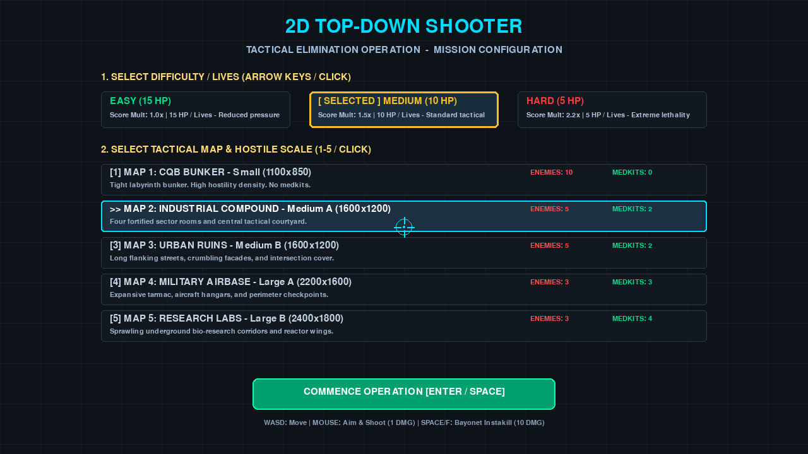
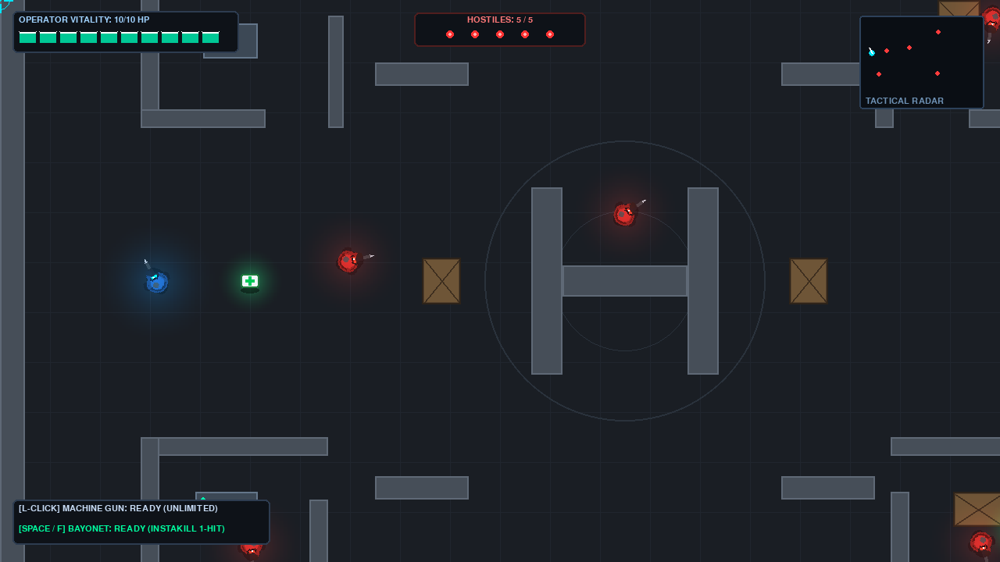
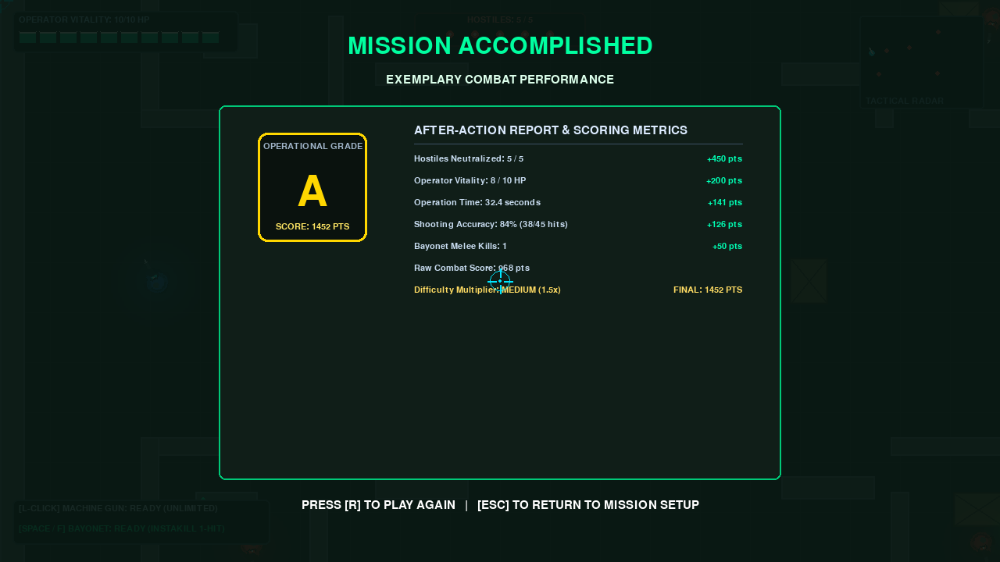

# 2D Top-Down Shooting Game

## English

A 2D top-down shooting game prototype built with Python and Pygame.
The player must eliminate all enemies across different maps and earn a final grade based on kills, remaining health, completion time, shooting accuracy, and melee kills.

### Features

- Five tactical maps with different sizes and layouts
- Three difficulty levels: Easy, Medium, and Hard
- Machine gun for ranged combat and bayonet for melee combat
- Enemy AI, line-of-sight detection, cover, and obstacle collisions
- Medical supply stations and medkits
- HUD with minimap, health, enemy count, and combat information
- Mission scoring system with Grades A-E

### Requirements

- Python 3
- Pygame 2.6.1

### Installation and Usage

Clone the repository and enter the project directory:

```bash
git clone https://github.com/sunweishan/2d-top-down-shooting-game.git
cd 2d-top-down-shooting-game
```

Create and activate a virtual environment:

```bash
python3 -m venv .venv
source .venv/bin/activate
```

Install the dependencies:

```bash
pip install -r requirements.txt
```

Start the game:

```bash
python main.py
```

### Controls

#### During Gameplay

| Action | Key |
|---|---|
| Move | `WASD` or Arrow Keys |
| Aim | Move the Mouse |
| Fire Machine Gun | Left Mouse Button |
| Bayonet Attack | `Space` or `F` |
| Pause / Resume | `Esc` |

#### Start Menu

| Action | Key |
|---|---|
| Select Map 1-5 | Number Keys `1` to `5` |
| Select Difficulty | `E` = Easy, `M` = Medium, `H` = Hard |
| Cycle Difficulty | Left / Right Arrow Keys |
| Start Mission | `Enter` or `Space` |

#### Pause and Result Screens

- Press `R` during pause to restart the mission.
- Press `M` during pause to return to the main menu.
- Press `R` after victory or defeat to play again.
- Press `Esc` after victory or defeat to return to mission setup.

### Testing

Run the game logic tests:

```bash
pytest -q
```

### Project Structure

```text
main.py             # Main game loop and state management
player.py           # Player control, movement, and attacks
enemy.py            # Enemy AI and behavior
weapon.py           # Machine gun and bayonet systems
bullet.py           # Bullets, collision, and damage detection
map.py              # Maps, obstacles, and cover
supply.py           # Medical supply system
sprites.py          # Character and object rendering
effects.py          # Visual effects
audio.py            # Audio management
ui.py               # Menus, HUD, pause, and result screens
test_game_logic.py  # Game logic tests
requirements.txt    # Python dependencies
```

### Screenshots

#### Start Menu



#### Gameplay



#### Victory Screen



---

## 中文

這是一款使用 Python 與 Pygame 製作的 2D 俯視角射擊遊戲原型。
玩家需要在不同地圖中消滅所有敵人，並根據擊殺數、剩餘生命值、完成時間、射擊準確率與近戰擊殺數取得最終評等。

### 遊戲特色

- 5 張不同規模與配置的戰術地圖
- Easy、Medium、Hard 三種難度
- 機槍遠程攻擊與刺刀近戰攻擊
- 敵人 AI、視線判定、掩體與障礙物碰撞
- 醫療補給站與醫療包
- 包含小地圖、生命值、敵人數量與戰鬥資訊的 HUD
- Grade A-E 任務評分系統

### 執行環境

- Python 3
- Pygame 2.6.1

### 安裝與執行

複製 repository 並進入專案資料夾：

```bash
git clone https://github.com/sunweishan/2d-top-down-shooting-game.git
cd 2d-top-down-shooting-game
```

建立並啟用 Python 虛擬環境：

```bash
python3 -m venv .venv
source .venv/bin/activate
```

安裝相依套件：

```bash
pip install -r requirements.txt
```

啟動遊戲：

```bash
python main.py
```

### 操作方式

#### 遊戲中

| 操作 | 按鍵 |
|---|---|
| 移動 | `WASD` 或方向鍵 |
| 瞄準 | 移動滑鼠 |
| 機槍射擊 | 滑鼠左鍵 |
| 刺刀攻擊 | `Space` 或 `F` |
| 暫停 / 繼續 | `Esc` |

#### 開始選單

| 操作 | 按鍵 |
|---|---|
| 選擇地圖 1-5 | 數字鍵 `1` 到 `5` |
| 選擇難度 | `E` = Easy、`M` = Medium、`H` = Hard |
| 切換難度 | 左右方向鍵 |
| 開始任務 | `Enter` 或 `Space` |

#### 暫停與結算畫面

- 暫停時按 `R` 重新開始任務。
- 暫停時按 `M` 回到主選單。
- 勝利或失敗後按 `R` 再玩一次。
- 勝利或失敗後按 `Esc` 回到任務設定。

### 測試

執行遊戲邏輯測試：

```bash
pytest -q
```

### 專案結構

```text
main.py             # 遊戲主迴圈與狀態管理
player.py           # 玩家控制、移動與攻擊
enemy.py            # 敵人 AI 與敵人行為
weapon.py           # 機槍與刺刀系統
bullet.py           # 子彈、碰撞與傷害判定
map.py              # 地圖、障礙物與掩體
supply.py           # 醫療補給系統
sprites.py          # 遊戲角色與物件繪製
effects.py          # 視覺特效
audio.py            # 音效管理
ui.py               # 選單、HUD、暫停與結算畫面
test_game_logic.py  # 遊戲邏輯測試
requirements.txt    # Python 套件需求
```

### 遊戲截圖

#### 開始選單


#### 遊戲畫面


#### 勝利畫面


